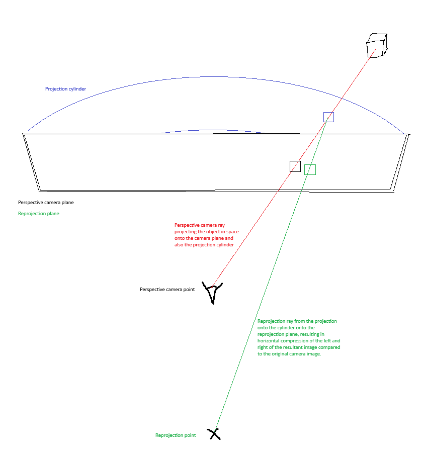

# Bevy Panini

Custom projection and post-processing to avoid painful distortions in 3D with a wide field of view (FOV) and rectilinear perspective projection onto a flat plane, as detailed in
[this research paper](https://www.researchgate.net/publication/220795340_Pannini_A_New_Projection_for_RenderingWide_Angle_Perspective_Images).
See also [this video](https://www.youtube.com/watch?v=LE9kxUQ-l14).

A Panini depth of 0.0 is a normal flat perspective projection onto a plane. A positive Panini depth is a projection onto a cylinder centred on the camera, and the reprojected from
further back. This compresses the left and right edges horizontally while leaving verticals vertical (when looking at the horizon). It also reduces the vertical FOV in the centre of the screen.

Note that the effect is achieved by post-processing a flat projection so extreme FOV and high Panini depths may result in black bars where the mapping is not possible or low resolution
where the image is being distorted most. Clipping of objects may be more of an issue too.

## Usage

* Include the crate `bevy_panini`.
* Add the plugin `PaniniPlugin`.
* Give your 3D camera the custom projection `PaniniProjection` using the component `Projection::custom(PaniniProjection::new().with_panini_depth(0.5).with_fov_y(0.8))` for instance.
* Select the vertical field-of-view (FOV) and Panini depth as required. The horizontal FOV will be calculated from these and the aspect ratio of the view.
* Changing the height of the view (e.g. resizing the window) results in the vertical FOV changing to match.
* Changing the width of the view (e.g. resizing the window) results in the horizontal FOV changing to match that and the given vertical FOV and Panini depth.

See the example `skyscrapers` using `cargo run --example skyscrapers`.
